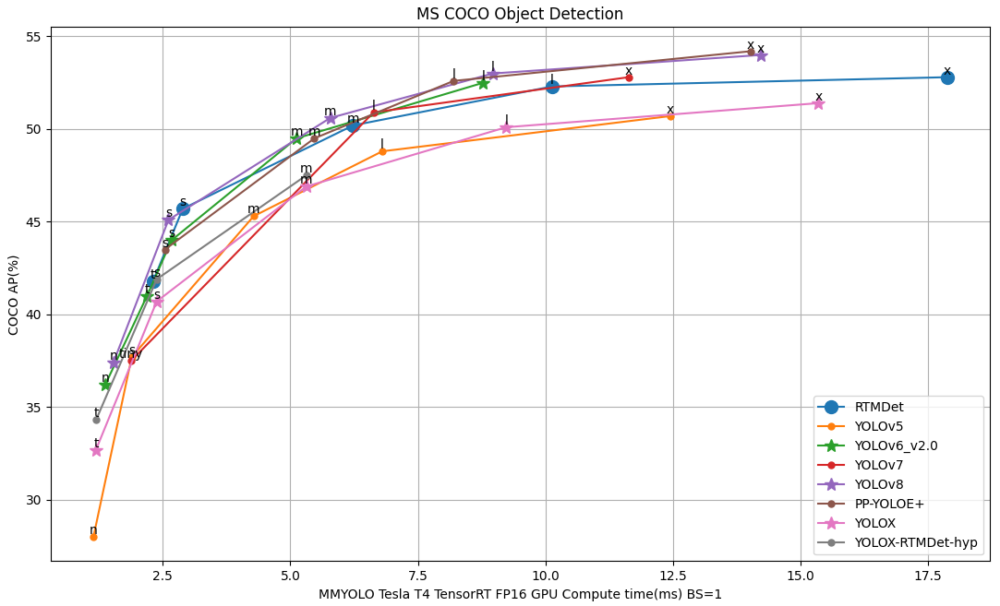

<div align="center">
  
  <div>&nbsp;</div>
  <div align="center">
    <b><font size="5">xtrt document</font></b>
    <sup>
      <a href="https://github.com/gitctrlx/xtrt/doc">
        <i><font size="4">HOT</font></i>
      </a>
    </sup>
    &nbsp;&nbsp;&nbsp;&nbsp;
    <b><font size="5">xtrt installation</font></b>
    <sup>
      <a href="https://github.com/gitctrlx/xtrt?tab=readme-ov-file#Installation">
        <i><font size="4">TRY IT OUT</font></i>
      </a>
    </sup>
  </div>
  <div>&nbsp;</div>

## 📄 Table of Contents

[TOC]

## 🎉 What's New

✨**v0.1.0** First release on March 8, 2024:

- Enables rapid deployment of various deep learning models, converting them into TensorRT engine files.
- Supports multi-precision model deployment, including int8 quantization, with fine-tuning capabilities during quantization.
- Supports Quantization-Dequantization (QDQ) for quantizing ONNX models.
- Facilitates model inference accuracy validation across multiple platforms (PyTorch, ONNXRuntime, TensorRT).
- Includes support for the Efficient NMS plugin, Rotated Object Detection NMS plugin, and YOLO decode plugin.

## 📚 Introduction

`X-TRT` is a lightweight and highly efficient deep learning model inference platform developed based on TensorRT C++. 

- **High Efficiency and Versatility**: X-TRT combines lightweight design and high efficiency, minimizing resource use and maximizing processing speed, making it ideal for a wide range of hardware. It's built with TensorRT C++ to enhance deep learning inference performance through optimized model execution.

- **Broad Compatibility and Deployment Options**: Designed for wide operating system compatibility, X-TRT supports major platforms like Ubuntu and Windows, and extends to high-performance edge computing with support for deployment on edge devices, including the Jetson series.

- **Streamlined and Optimized Deployment**: X-TRT simplifies the deployment process for deep learning models, facilitating easier use across cloud and edge computing environments while optimizing model execution to efficiently unlock the full potential of deep learning technologies.

## ⚙️ Installation

### 💡 Prerequisites

To build the X-TRT components, you will first need the following software packages.

**TensorRT GA build**

- [TensorRT](https://developer.nvidia.com/nvidia-tensorrt-download) >= v8.5

**System Packages**

- [CUDA](https://developer.nvidia.com/cuda-toolkit)

  Recommended versions:

  - cuda-12.2.0 + cuDNN-8.8
  - cuda-11.8.0 + cuDNN-8.8

- [GNU make](https://ftp.gnu.org/gnu/make/) >= v4.1

- [cmake](https://github.com/Kitware/CMake/releases) >= v3.11

- [python](https://www.python.org/downloads/) >= v3.8, <= v3.10.x

- [pip](https://pypi.org/project/pip/#history) >= v19.0

- Essential utilities

  - [git](https://git-scm.com/downloads), [pkg-config](https://www.freedesktop.org/wiki/Software/pkg-config/), [wget](https://www.gnu.org/software/wget/faq.html#download)

**Pytorch（Optional）**

- You need the CUDA version of [PyTorch](https://pytorch.org/get-started/locally/). If your device is **Jetson**, please refer to the [Jetson Models Zoo](https://elinux.org/Jetson_Zoo) for installation.

### 🛠️ build

Building the Basic Inference Framework：

```bash
$ git clone https://github.com/gitctrlx/xtrt.git
cmake -S . -B build 
cmake --build build
```

> If you wish to compile the eval tool, please add the option `-DBUILD_TOOLS_EVAL=ON` during compilation. 
> If you are unsure about your CUDA SM version, you can run `tools/cudasm.sh` to check. For more details, please see [FAQ](doc/faq.md).

If you would like to use the complete set of tools developed in Python, please install the following: (Optional)

```python
python3 -m pip install requirements.txt
```

## ✏️ Tutorial

### 🧨 Quick Start

#### 1. Data Preparation

Data is used for calibration during quantization. We plan to use the [COCO val dataset](http://images.cocodataset.org/zips/val2017.zip) for model quantization calibration work. 将下载好的val2017数据集放在 data/coco目录下。

```bash
├── cmake
├── common
├── config
├── data
│   └── coco
│       ├── annotations
│       └── val2017
├── weights
├── engine
├── media
├── output
├── plugins
├── scripts
├── tools
└── docker
```

#### 2. Model Preparation

Place the prepared ONNX file into the weights folder. You can directly download the ONNX weights we have exported from HuggingFace, all weights originate from mmyolo pre-trained weights. You also have the option to configure mmyolo to freely export weights, or use other object detection models to export ONNX. The related code can be found in `tools/modify_onnx`.

> There are two formats of ONNX exported by mmyolo. One is an end-to-end ONNX that has added the `EfficientNMS` node from `TensorRT8`, and the other is a pure model part that has removed the decode part (including three output results). For detailed content, please see the [detailed tutorial](doc/tutorial.md) document. You can use the ONNX model that has added `EfficientNMS`, or use the model that has removed the decode part and manually add plugins for acceleration. The related code can be found in `tools/modify_onnx`.

#### 3. Building the Engine

Once the dataset is ready, the next step is to construct the engine. Below is an example for building a YOLOv5s TensorRT engine, with the corresponding code located in `scripts/build.sh`:

```sh
./build/build \
    "./weights/yolov5s_trt8.onnx" \    # ONNX Model File Path
    "./engine/yolo.plan" \			   # TensorRT Engine Save Path
    "int8" \						   # Quantization Precision
    3 \								   # TRT Optimization Level
    1 1 1 \							   # Dynamic Shape Parameters
    3 3 3 \							 
    640 640 640 \					   
    640 640 640 \					   
    550 \							   # Calibration Iterations
    "./data/coco/val2017" \			   # Calibration Dataset Path
    "./data/coco/filelist.txt" \	   # Calibration Image List
    "./engine/int8Cache/int8.cache" \  # Calibration File Save Path
    true \							   # Timing Cache Usage
    false \							   # Ignore Timing Cache Mismatch
    "./engine/timingCache/timing.cache"# Timing Cache Save Path
```

For a detailed analysis of the code's parameters, please see the [detailed documentation](doc).

#### 4. Executing Inference（demo）

Inferencing a single image using the built YOLO TensorRT engine.

```sh
./build/yolo_det_img \
    "engine/yolo_m.plan" \   # TensorRT Engine Save Path
    "media/demo.jpg" \	     # Input Image Path
    "output/output.jpg"\     # Output Image Path
    2 \ 				     # Pre-processing Pipeline
    1 3 640 640			     # Input Model Tensor Values
```

Inferencing a video using the built YOLO TensorRT engine.

```sh
./build/yolo_det \
    "engine/yolo_trt8.plan" \ # TensorRT Engine Save Path
    "media/c3.mp4" \		  # Input Image Path 
    "output/output.mp4"\	  # Output Image Path
    2 \						  # Pre-processing Pipeline
    1 3 640 640				  # Input Model Tensor Values
```

For a detailed analysis of the code's parameters, please see the [detailed documentation](doc).

## 💻 Overview of Benchmark and Model Zoo



> The evaluation results above are from the [MMYOLO](https://mmyolo.readthedocs.io/zh-cn/latest/model_zoo.html) model under FP16 precision. The "TRT-FP16-GPU-Latency(ms)" refers to the GPU compute time for model forwarding only on the NVIDIA Tesla T4 device using TensorRT 8.4, with a batch size of 1, testing shape of 640x640 (for YOLOX-tiny, the testing shape is 416x416).
>
> In practical tests, we found that on the Jetson platform, due to differences in memory size, there might be some impact on the model's accuracy. This is because TensorRT requires sufficient memory during the engine construction phase to test certain strategies. Across different platforms, there could be an accuracy loss of about 0.2%-0.4%.

## 📖 Document

For more detailed tutorials about the project, please refer to the [detailed documentation](doc).

## ❓ FAQ

Please refer to the [FAQ](doc/faq.md) for frequently asked questions.

## 🧾 License

This project is released under the [GPL 3.0 license](LICENSE.txt).

## 🎯 Reference

This project references many excellent works from predecessors, and some useful repository links are provided at the end.

1. [TensorRT](https://github.com/NVIDIA/TensorRT)
2. [mmyolo](https://github.com/open-mmlab/mmyolo)
3. [Lidar_AI_Solution](https://github.com/NVIDIA-AI-IOT/Lidar_AI_Solution)

